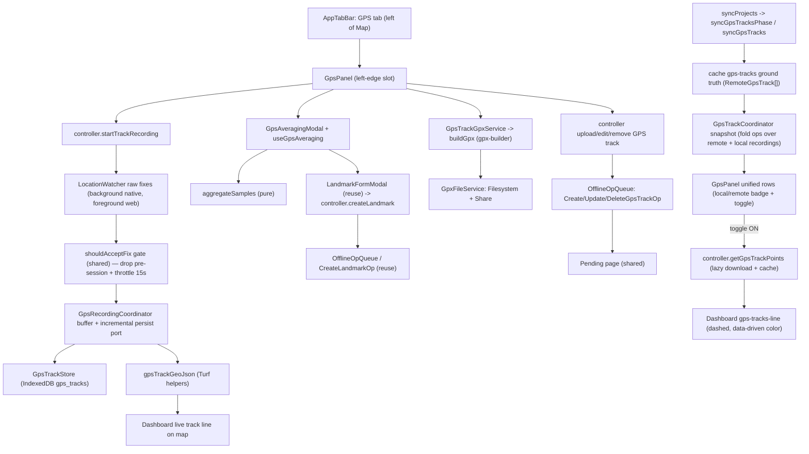

# GPS Tracks, Averaging, Export & Upload

The **GPS** menu (a tab to the left of **Map**) lets a field user record GPS
tracks, collect a high-confidence averaged point and save it as a landmark,
export/share tracks as GPX, and upload them to SpeleoDB. Everything is
offline-first: captured fixes are persisted locally, so offline use and process
death do not silently discard collected points.

This document is the source of truth for the feature's intent, architecture, API
contracts, the averaging/confidence model, the offline model, known limitations,
and the test strategy.

## Feature intent

- **Record a GPS track** -- capture the path you walk as a trail of GPS points
  (a cave-entrance approach, a resurgence, a survey traverse) so the real-world
  surface route can be overlaid on top of the cave survey. To keep tracks light
  it samples ~**one point every 15 s** (`GPS.TRACK_SAMPLE_INTERVAL_MS`); the
  finished track can be exported as GPX or uploaded directly to SpeleoDB. It
  runs on a dedicated full-screen recording screen (`GpsRecordingScreen`, opened
  from the GPS panel via "GPS Track Recording") that shows live ongoing status
  -- duration, distance, point count -- with Start / Pause / Resume / Stop
  controls. Duration counts active recording time from Start and **excludes
  paused wall time**, so pausing for ten minutes does not inflate the saved
  recording timer. A **back button** on the top-left leaves the screen _without_
  stopping the recording (recording lives in the recording coordinator and keeps
  running in the background -- including with the screen locked or the app
  backgrounded, see _Background recording_ below); a separate **Cancel** button
  _abandons_ the recording -- when recording/paused it confirms first and then
  **discards** the in-progress track, when idle it simply closes the screen. The
  track draws live on the map and captured fixes are persisted incrementally. If
  the process is killed, the partial track is recovered as a local saved track
  on next launch; recording itself is not resumed automatically.
- **High-Accuracy GPS Point** -- collect a single high-confidence point by
  averaging GPS fixes over ~1-2 minutes. The collector opens straight to the
  measurement view in a **held** state (placeholder values, GPS watch off). The
  user presses **Start** to begin, **Stop** to halt, **Reset** to clear and
  re-acquire, watches confidence, horizontal/vertical accuracy and a
  **multi-constellation satellite checklist** improve, then saves the point as a
  landmark (online or offline) with name/description.
- **Export / share** a recorded track as a standard GPX 1.1 file.
- **One unified track list** mixing tracks recorded **on this device** and
  tracks stored **on SpeleoDB**. Device recordings are flagged with a "Local"
  badge; a clean server track shows no badge (only a pending/conflict state
  does). Server tracks sync at launch / manual refresh like projects/landmarks.
- **Display tracks on the map** — every panel row has an **`IonToggle` switch**
  (like the project panel), **OFF by default**; a track is only drawn (a dashed,
  track-colored line) once turned on. **Tapping the row body zooms** the map to
  fit the track (turning it on + closing the panel). The remote geometry is
  downloaded lazily on first toggle/tap and cached. The live recording line is
  always shown while recording and updates on every kept fix (~15 s). Its latest
  accepted point also feeds the shared blue user-location indicator: recording
  shows dot + phone-heading cone, pause keeps only the dot, and stop removes the
  recording-owned indicator. An independently enabled My Location source remains
  live and takes priority. See `docs/user-location-heading.md`.
- **Create / edit / delete via the shared offline op queue.** Every track
  mutation is an `OfflineOp` in the same queue as landmarks and shows on the
  **Pending** page (see `docs/offline-op-queue.md`):
  - **Create = upload the GPX.** On a confirmed success the local recording is
    **deleted** and the server track list re-syncs (the local copy is replaced
    by the server track). Offline, it queues a `CreateGpsTrackOp`.
  - **Edit = change name and/or color.** Local recordings edit in place (no
    network); server tracks `PATCH /api/v2/gps_tracks/<id>/` (queued offline).
    The edit modal is **top-anchored** (not vertically centered) so the
    on-screen keyboard does not re-center and lurch the form when the Name field
    focuses; the selected color is shown with a **contrasting checkmark**
    (`readableInkColor`, black on light swatches / white on dark) plus a
    dark-gap + white ring, which stays visible on every palette color (a
    same-color border did not).
  - **Delete** (behind a confirmation modal): local recordings are removed from
    the device; server tracks `DELETE` (queued offline).

## Where it lives (source map)

| Concern                                                 | File                                                                                                                                                                                 |
| ------------------------------------------------------- | ------------------------------------------------------------------------------------------------------------------------------------------------------------------------------------ |
| Types                                                   | `src/types/gpsTrack.ts`, `src/types/gnss.ts`                                                                                                                                         |
| GNSS satellite status provider                          | `src/services/GnssStatusProvider.ts` (default "unsupported"; Android plugin is a follow-up)                                                                                          |
| GPX export/upload builder                               | `src/utils/gpx.ts` (`gpx-builder` adapter)                                                                                                                                           |
| GPS track GeoJSON construction + geojson->points        | `src/utils/gpsTrackGeoJson.ts` (`@turf/helpers` adapter)                                                                                                                             |
| Track colors (palette, validate, random, readable ink)  | `src/utils/gpsTrackColors.ts`                                                                                                                                                        |
| Server track parsing                                    | `src/utils/remoteGpsTrack.ts` (`parseRemoteGpsTracks`)                                                                                                                               |
| Averaging math + confidence (pure)                      | `src/utils/gpsAveraging.ts`                                                                                                                                                          |
| Shared GPS fix gate (pre-session drop + throttle, pure) | `src/utils/gpsSampling.ts`                                                                                                                                                           |
| Track stats: distance/duration (pure)                   | `src/utils/gpsTrackStats.ts`                                                                                                                                                         |
| Accuracy/unit formatting                                | `src/utils/measurementUnits.ts` (`formatAccuracyValue`)                                                                                                                              |
| Share cancellation helper                               | `src/utils/share.ts`                                                                                                                                                                 |
| UUID helper                                             | `src/utils/ids.ts`                                                                                                                                                                   |
| Foreground position watch (averaging/web)               | `src/services/GeolocationWatcher.ts` (`LocationWatcher` iface)                                                                                                                       |
| Background-capable watch (recording, native)            | `src/services/BackgroundGeolocationWatcher.ts` (+ `createRecordingLocationWatcher`)                                                                                                  |
| Battery-optimization nudge (Android)                    | `src/services/BatteryOptimizationGuard.ts`                                                                                                                                           |
| Local recording persistence (IndexedDB)                 | `src/services/GpsTrackStore.ts` (+ `gps_tracks` store in `src/services/CacheStore.ts`)                                                                                               |
| Server track cache (list + per-track geojson)           | `src/services/ProjectCacheService.ts` (`gps-tracks` key + `gps-track:<id>` keys)                                                                                                     |
| Shared track -> GPX preparation                         | `src/services/GpsTrackGpxService.ts` (`gpx-builder` adapter)                                                                                                                         |
| GPX file write + share                                  | `src/services/GpxFileService.ts`                                                                                                                                                     |
| Transport                                               | `src/services/SpeleoDBService.ts` (`uploadGpx`, `getGpsTracks`, `updateGpsTrack`, `deleteGpsTrack`) + `src/services/HttpClient.ts` (native multipart)                                |
| Offline op queue (create/edit/delete)                   | `src/offline/OfflineOpQueue.ts`, `src/offline/ops/{Create,Update,Delete}GpsTrackOp.ts`, `src/offline/gpsTrackSnapshot.ts` (see `docs/offline-op-queue.md`)                           |
| Per-track visibility preference (default OFF)           | `src/services/PreferencesService.ts` (`gpsTrackVisibility`)                                                                                                                          |
| Recording state machine                                 | `src/controllers/GpsRecordingCoordinator.ts`                                                                                                                                         |
| Track state, persistence, geometry, GPX, snapshots      | `src/controllers/GpsTrackCoordinator.ts`                                                                                                                                             |
| Upload/edit/delete and server sync                      | `src/controllers/GpsTrackMutationCoordinator.ts`                                                                                                                                     |
| Public façade                                           | `src/controllers/SpeleoDBController.ts`                                                                                                                                              |
| React bridge                                            | `src/context/useSpeleoDB.ts`, `src/context/SpeleoDBStoreProvider.tsx`                                                                                                                |
| Averaging session hook                                  | `src/hooks/useGpsAveraging.ts`                                                                                                                                                       |
| UI                                                      | `src/components/GpsPanel.tsx`, `src/components/GpsRecordingScreen.tsx`, `src/components/GpsAveragingModal.tsx`, `src/components/GpsScreenHeader.tsx`, `src/components/AppTabBar.tsx` |
| Dashboard GPS presentation                              | `src/pages/dashboard/DashboardGpsActivity.tsx`, `src/pages/dashboard/DashboardGpsTrackDialogs.tsx`                                                                                   |
| Dashboard track actions                                 | `src/pages/dashboard/useDashboardGpsTrackActions.ts`                                                                                                                                 |
| Dashboard recording/averaging actions                   | `src/pages/dashboard/useDashboardGpsRecordingActions.ts`                                                                                                                             |
| Shared user position/heading indicator                  | `src/components/map/UserLocationIndicator.tsx`, `src/services/DeviceHeadingService.ts`                                                                                               |
| Dashboard GPS orchestration                             | `src/pages/Dashboard.tsx`                                                                                                                                                            |

## Architecture / data flow

State ownership follows `docs/implementation-guidelines.md` and
`docs/gps-recording-coordination.md`: `GpsRecordingCoordinator` owns the
recording/watch state machine and delegates durable writes and publication
through narrow track-coordinator ports. `GpsTrackCoordinator` owns the unified
track list, persistence, geometry, GPX preparation, and snapshots;
`GpsTrackMutationCoordinator` owns server sync and mutation policy;
`SpeleoDBController` retains only the public façade and replay-port wiring;
`GeolocationWatcher`/`GpsTrackStore`/`GpxFileService` perform side effects;
`GpsPanel`/`GpsAveragingModal` are presentational; the focused Dashboard GPS
wrappers compose recording, averaging, upload, edit, and delete presentation
without owning controller or persistence behavior; `useDashboardGpsTrackActions`
owns track visibility, lazy geometry, sharing, map zoom, and mutation-dialog
action state; `useDashboardGpsRecordingActions` owns recorder-screen actions,
live recording geometry, latest accepted map location, the battery-optimization
hint, averaging UI transitions, and the landmark-create handoff;
`useGpsAveraging` isolates the averaging session's side effects from the modal.

The unified `controller.gpsTracks` snapshot, produced by `GpsTrackCoordinator`,
is **rebuilt only when `gpsTracksRevision` changes** (a
recording/edit/delete/sync or a queue change), not on every `notify()`.
Offline-map progress uses a separate external store and never reaches this
controller observer; other online/sync notifies reuse the same array reference,
so the Dashboard's `gps-tracks` map source is not recomputed/re-fed on every
tick and `summarizeTrack` does not run over every local recording each time.

Confirmed remote-track upserts and removals are applied with
`ProjectCacheService.updateGpsTracks()`, a strict single-entry IndexedDB
transaction. Concurrent confirmations serialize without dropping unrelated
tracks, and the in-memory list/revision advances only after durable completion.
A cache read, write, abort, or schema failure is therefore reported to the
mutation/replay owner instead of presenting a server-only result as locally
saved. This replaces the former split read/write path without adding network or
compute work.

## Shared GPS reading gate (one path, two cadences)

Both GPS features run raw fixes through one shared sampling gate. Recording uses
a `LocationWatcher` (`BackgroundGeolocationWatcher` on native,
`GeolocationWatcher` on web); averaging uses `GeolocationWatcher`. Both use the
same high-accuracy intent, no watcher-level filters, and then run every fix
through the same pure gate, `shouldAcceptFix(timestamp, gate)` in
`src/utils/gpsSampling.ts`, which:

1. **Drops stale watch-start fixes** -- when a watch starts, iOS/Android replay
   the cached last-known location with its _old_ timestamp; anything older than
   the active watch start (minus a small timestamp-lag grace) is dropped so the
   timer starts from a real fix rather than an OS replay.
2. **Throttles by time** -- keeps at most one fix per `minIntervalMs`; the first
   in-session fix is always kept immediately, so acquisition feels instant.

The **only** difference between the two features is the cadence:

| Feature                                         | `minIntervalMs`                              | Why                                                                   |
| ----------------------------------------------- | -------------------------------------------- | --------------------------------------------------------------------- |
| High-Accuracy GPS Point (`useGpsAveraging`)     | `GPS.AVERAGING_MIN_SAMPLE_INTERVAL_MS` (1 s) | Wants many samples to average down error.                             |
| GPS Track Recording (`GpsRecordingCoordinator`) | `GPS.TRACK_SAMPLE_INTERVAL_MS` (15 s)        | A surface walking path doesn't need dense points; keeps tracks small. |

**Why this matters (regression fixed):** recording previously used the watcher's
`minDistanceMeters: 2` filter. The watcher's "last kept" was set to the OS's
replayed last-known location, so while the user stood still every real fix was
within 2 m of that stale point and was silently dropped -- the first recorded
point took ~15-20 s (or never) to appear, while averaging (which never used the
distance filter) was instant. Moving recording onto the shared time gate makes
its first point appear as fast as averaging's.

## GPX contract

`GpsTrackGpxService` is the single shared "track -> GPX file" seam used by both
Share GPX and Upload. It maps a `LocalGpsTrack` into
`buildGpx({ tracks, metadata }, creator)` (`src/utils/gpx.ts`), a thin app
adapter over **`gpx-builder`**. A recorded track becomes one `<trk>` with one or
more `<trkseg>` entries; each fix is mapped to a `<trkpt lat lon>` with optional
`<ele>` (altitude, meters) and `<time>` (ISO-8601). XML construction and
escaping are owned by `gpx-builder`; app code owns policy: coordinate
validation/filtering, metadata mapping, filename selection, and the creator
string. The import path normalizes both named and default exports because
Capacitor production bundles can expose CommonJS-shaped modules differently than
tests. The Vite config also aliases the Node `events` and `url` built-ins to
browser-safe polyfills because `gpx-builder`'s XML dependency graph imports
them.

After that shared preparation step, the flows intentionally split:

- `GpxFileService.shareGpx` writes/shares the prepared file.
- The `CreateGpsTrackOp` replay (and the controller's online attempt) build the
  GPX via the same `GpsTrackGpxService` and PUT it through
  `SpeleoDBService.uploadGpx`. `controller.buildGpxFileForTrack` is the shared
  share/export seam (it loads a remote track's points on demand for re-export).

This keeps GPX conversion diagnostics consistent across share and upload while
keeping sharing and uploading modular.

## GeoJSON contract

The app does not store, parse, or render GPX. The canonical live buffer is still
`RecordedPoint[]`; map display uses `src/utils/gpsTrackGeoJson.ts`, which builds
GeoJSON with **`@turf/helpers`**:

- `trackPointsToLineStringFeature` maps valid recorded points to a GeoJSON
  `LineString` using `[longitude, latitude, altitude?]` coordinates (the
  `properties` carry `id`, `name`, `color`, `origin`).
- `trackPointsToFeatureCollection` feeds the Dashboard live recording source.
- `latestValidRecordingLocation` scans the accepted point buffer backward for
  the shared user-location dot. It supports a one-point track and ignores an
  invalid trailing fix. This is presentation-only and does not alter sampling.
- The Dashboard builds one shared `gps-tracks-source` FeatureCollection of all
  _visible_ tracks (a `trackPointsToLineStringFeature` per track) and renders it
  with a single dashed `gps-tracks-line` layer colored by `['get','color']`
  (`line-dasharray: [2, 2]` — kept clearly visible; sub-pixel dashes render
  invisibly in the Android WebView).
- `gpsTrackGeoJsonToPoints` flattens a downloaded server-track GeoJSON
  (LineString/MultiLineString features) back into `RecordedPoint[]` for display
  and GPX re-export of a remote track.

Server tracks are delivered as a pre-signed GeoJSON URL (`file`). Geometry is
downloaded lazily for display and eagerly with bounded concurrency during full
sync for offline tile planning. The cached FeatureCollection carries the server
SHA-256 identity, so changed server bytes cannot reuse stale geometry
(`getGpsTrackGeoJSONRecord`). Ordinary display deliberately accepts valid legacy
cached geometry even when it lacks that SHA, preserving existing offline maps.
Planning is stricter: it requires the current non-empty server SHA and a
matching valid cache record, or refreshes up to three server tracks
concurrently. A missing SHA/URL, unavailable network, invalid response, or
failed cache write aborts the whole rolling replacement so partial GPS coverage
cannot replace the active generations. GPX remains an interchange/export/upload
format generated on demand from `RecordedPoint[]`.

## Server contracts (SpeleoDB)

**Sync the list** (like projects/landmarks):

- `GET /api/v2/gps_tracks/` -> a bare array of
  `{ id, name, color, file, sha256_hash, creation_date, modified_date }`, where
  `file` is a pre-signed GeoJSON URL. The v2 API is not envelope-wrapped, so
  `response.data` is the array directly (`parseRemoteGpsTracks`). Cached as the
  `gps-tracks` ground truth in `ProjectCacheService`.

**Create = upload** reuses the backend's GPX import endpoint:

- `PUT /api/v2/import/gpx/`, `Authorization: Token <token>`,
  `multipart/form-data` field `file` (the `.gpx` document).
- Success `2xx` body: `{ landmarks_created, gps_tracks_created }`.
- The backend turns GPX tracks into `GPSTrack` rows (default a random palette
  `color`) and dedupes on the file **sha256**, so re-importing the same GPX is
  idempotent (returns zeros) -- which is what makes the create-op replay safe.
- On a confirmed success `GpsTrackMutationCoordinator` **deletes the local
  recording** and calls `syncGpsTracks()` so the server copy replaces it.
- **Force-quit window (online create).** The online path runs
  `upload -> delete local -> re-sync` without enqueuing an op. A crash _between_
  the confirmed upload and the local delete leaves the local recording on the
  device while the server already has the track, so the unified list briefly
  shows both (the local one keeps its "Local" badge). This is **not** data loss
  and self-heals: re-uploading is idempotent (the backend dedupes by file
  sha256, returns `gps_tracks_created: 0`), and that success deletes the
  stranded local copy. The queued create path (offline) is fully self-healing on
  its own because the op survives the crash and replays. We accept the tiny
  online-create window rather than always routing create through the queue,
  which would trade immediate feedback for a Pending-page round-trip.

**Edit / delete**:

- `PATCH /api/v2/gps_tracks/<id>/` with `{ name?, color? }` -> updated object.
- `DELETE /api/v2/gps_tracks/<id>/`.
- Both are routed through the offline op queue (online attempt, enqueue on
  unreachable, throw on definitive 4xx). See `docs/offline-op-queue.md`.

### Native multipart (important)

`HttpClient` only supports `FormData` on web; it is ignored on native. The GPX
upload therefore uses a cross-platform `multipart` payload
(`HttpRequest.multipart`): on web it builds a real `FormData`; on native it
serializes a raw `multipart/form-data` body **string** with an explicit boundary
and matching `Content-Type` for `CapacitorHttp`. GPX is text, so a string body
is byte-correct (no binary encoding needed). The native serializer quotes
multipart names/filenames, rejects CRLF injection in text fields, and rejects a
GPX body containing the generated boundary delimiter. See `buildMultipartString`
in `src/services/HttpClient.ts`.

## Averaging + confidence model

`aggregateSamples(samples, config, now)` (`src/utils/gpsAveraging.ts`):

- **Rejection**: fixes with non-finite/out-of-range coordinates, or horizontal
  accuracy worse than `GPS.AVERAGING_MAX_ACCURACY_METERS`, are dropped (counted
  as `rejectedCount`).
- **Only fixes recorded after Start count, ~1 fix/second.** Intake goes through
  the shared `shouldAcceptFix` gate (see _Shared GPS reading gate_ above) with
  `GPS.AVERAGING_MIN_SAMPLE_INTERVAL_MS` (1 s): stale watch-start replayed fixes
  are dropped (with a small timestamp-lag grace for fresh fixes) and sub-second
  bursts are throttled, so the sample count climbs like seconds rather than
  jumping. Correlated sub-second fixes add no real accuracy, so this also keeps
  the average sound.
- **Position**: inverse-variance weighted mean of lat/lng (a fix's weight is
  `1/accuracy²`; fixes without accuracy get unit weight). More accurate fixes
  count more.
- **Altitude**: averaged only over fixes that report it (weighted by
  `1/altitudeAccuracy²`), else `null`.
- **Combined horizontal accuracy**: `sqrt(1 / Σ(1/accuracyᵢ²))`, which improves
  as more fixes accumulate (e.g. four 10 m fixes -> 5 m). `null` if no fix
  reported accuracy.
- **Confidence (0-100)**: `round(100 · base · accuracyScore)` where
  `base = (0.5·timeProgress + 0.5·sampleProgress) ^ CONFIDENCE_EXPONENT` (each
  progress clamped 0-1 against `TARGET_MS`/`TARGET_SAMPLES`) and `accuracyScore`
  is 1.0 at/under `GOOD_ACCURACY_METERS`, a floor at/over
  `POOR_ACCURACY_METERS`, linear between. The exponent
  (`AVERAGING_CONFIDENCE_EXPONENT`, default `2.2`) keeps confidence low early
  and only lets it climb as both time and samples approach their targets, so it
  does not race to a high value in the first few seconds. With fixed accuracy,
  confidence is still monotonic in time and samples and only reaches 100 at both
  targets.
- **Stable**: `elapsedMs >= MIN_MS && sampleCount >= MIN_SAMPLES` — the "good
  enough to save" hint. Save is allowed at any time, but the UI nudges the user
  to keep collecting until stable.

Constants live in the `GPS` block of `src/constants.ts` (`AVERAGING_MIN_MS=60s`,
`AVERAGING_TARGET_MS=120s`, `AVERAGING_MIN_SAMPLES=30`,
`AVERAGING_TARGET_SAMPLES=60`, accuracy bands, watch options).

Saving an averaged point **reuses** the shared `LandmarkFormModal` +
`controller.createLandmark` seam, so it works online (POST) and offline (queued
`CreateLandmarkOp`) with zero extra wiring. See `docs/landmark-crud.md` and
`docs/offline-op-queue.md`.

### Session controls (stopwatch semantics)

The collector behaves like a stopwatch and never runs the GPS watch in the
background. `useDashboardGpsRecordingActions` tracks an `averagingPhase` of
`idle | running | stopped`, and `useGpsAveraging` is active only while phase is
`running`:

- **Start** (from `idle` or `stopped`) -> `running`: requests permission and
  begins/resumes the high-accuracy watch. Resuming **continues** appending to
  the same sample set (it does not start over).
- **Stop** -> `stopped`: releases the watch but **keeps** the collected samples
  and the last averaged result frozen on screen. Paused wall time is excluded
  from elapsed time/confidence. The primary button becomes **Start** again to
  resume.
- **Reset** -> shows a **confirmation modal** (`ConfirmDialog`,
  `gps-averaging-reset-confirm`). On confirm it bumps `restartNonce`, which
  clears the hook's samples: if `running`, collection continues from zero; if
  `stopped`, it drops back to the zeroed held state. Reset is the **only**
  action that wipes data.
- **Save** stores the current averaged point (enabled whenever a fix exists,
  running or paused). The **back button** on the top-left (see _Shared screen
  layout_ below) closes the collector and resets it to `idle`.

### Shared screen layout

Both full-screen GPS tools (`GpsRecordingScreen` and `GpsAveragingModal`) share
the same header via `GpsScreenHeader`: a **back button on the top-left** and a
centered page title (`High-Accuracy GPS Point` / `GPS Track Recording`). The
recording screen additionally renders its ready/recording status tag in the
header's right slot. This keeps the two tools visually consistent and gives
every full-screen GPS view an obvious way out.

The back button's meaning differs by tool: on the collector it closes and resets
the session; on the recorder it leaves _without_ stopping (recording keeps
running). The recorder's separate **Cancel** button is the destructive "abandon"
path -- it confirms (`ConfirmDialog`, `gps-recording-cancel-confirm`) and calls
`controller.discardTrackRecording()` to stop the watch and delete the
in-progress track when recording/paused, or just closes the screen when idle.
`discardTrackRecording()` mirrors `stopTrackRecording()` minus the persist step:
it stops the watch, removes the in-progress record from `GpsTrackStore`, and
resets state to `idle` without adding a saved track. If deletion fails, the
recording remains paused and visible for retry instead of disappearing only in
memory.

Recorder commands are single-flight and serialized by `GpsRecordingCoordinator`.
Repeated taps cannot start two watchers, stop/finalize twice, or issue two
deletions. Start/pause/resume/stop/discard validate their state when their turn
arrives and reject invalid transitions deterministically. The Dashboard owns
every returned promise: permission, pause/resume, stop/discard persistence, and
battery-optimization failures produce fixed error feedback, while late results
after unmount are ignored. This lane uses no timers or polling and prevents
duplicate native/persistence work.

Mechanically: pausing toggles the hook's `active` to false. The watch effect's
cleanup stops the watch/GNSS provider but **does not** clear `samples` (so the
result stays frozen). Clearing happens only via the render-phase reset guarded
by `restartNonce` (React's "adjust state when a prop changes" pattern), which
fires regardless of whether the session is running or paused.

## Multi-constellation & multi-band (GNSS) status

Modern phone receivers automatically track every GNSS constellation (GPS,
GLONASS, Galileo, BeiDou, QZSS, SBAS) and, on capable hardware, multiple
frequency bands (L1 + L5/E5/B2a) and fuse whatever they can. **The app cannot
choose or force the mix** — it only requests high accuracy
(`enableHighAccuracy: true`), which lets the OS use all of it. "The more mixed
the better" is therefore a device/OS capability, already maximized.

The averaging modal shows a **satellite checklist** with a green check / red
cross per constellation, driven by an injectable `GnssStatusProvider`
(`src/services/GnssStatusProvider.ts`) surfaced through `useGpsAveraging` as a
`GnssStatusSnapshot`:

- `inUse === true` -> green check; `false` -> red cross; `null` / unsupported ->
  a neutral dash.
- A **Multi-band / Single band** badge appears when the platform reports it.

**Platform reality (important):** live per-constellation / multi-band status is
exposable **only on Android** (the native `GnssStatus` / `GnssMeasurement`
APIs). **iOS (CoreLocation) and the web expose nothing** — they hand apps a
high-level position with no satellite detail, and `@capacitor/geolocation`
surfaces none of it on any platform. So the **default provider reports
`supported: false`**.

To avoid a confusing all-dashes list, the UI adapts to `gnss.supported`:

- **Supported (Android, with a native provider wired):** the per-constellation
  checklist renders with green check (in use) / red cross (visible-but-unused)
  and the multi-band badge.
- **Unsupported (iOS / web):** the per-constellation rows are **hidden** (they
  would be meaningless dashes). Instead a single honest **GNSS fix indicator**
  is shown — "Acquiring GNSS fix…" while running without a fix, "GNSS fix
  acquired" (green check) once readings arrive, "Not started" when held — plus a
  note that the device auto-combines every constellation/band it can receive and
  a per-satellite breakdown isn't available on the platform. No data is faked.

A native Android `GnssStatus` plugin can be dependency-injected later (via
`useGpsAveraging`'s `gnssProvider` option) to light up the real green/red
checklist; iOS can never support it. This is a tracked follow-up.

## Offline-first model

GPS work mirrors the landmark offline model (`docs/networking.md`,
`docs/offline-mode.md`), request-driven, with no passive connectivity listeners.

- **Recording** is fully local and always available; it writes nothing to the
  network. The in-progress track is persisted to IndexedDB **incrementally** (on
  each kept fix), with per-track writes serialized so a slower earlier write
  cannot overwrite a newer longer point buffer. A force-quit mid-recording
  recovers the captured points on next launch as a local partial track. The
  watch is not automatically restarted after process death. Nothing is written
  **until the first fix arrives** -- persisting an empty record up front would,
  on a force-quit during GPS warm-up, leave a useless 0-point "track" that can't
  be uploaded; `GpsTrackStore.list()` additionally drops (and self-heals) any
  0-point record left by older builds. Incremental and final write failures are
  authoritative. Incremental failure shows a recording error while retaining the
  live buffer; final failure keeps the session paused with every point so Stop
  can be retried. “Track saved” is emitted only after the final durable write. A
  fatal permission callback first reports that saving is in progress and changes
  to “saved” only after commit; on failure it retains the same recoverable
  session.
- **Create / edit / delete go through the shared offline op queue** — the exact
  same mechanism as landmarks (`docs/offline-op-queue.md`). There is **no**
  GPS-specific `uploadStatus` field and **no** GPS-specific auto-drain anymore;
  the per-track pending state shown in the panel is _derived_ from the queue
  (`OfflineOpQueue.gpsPendingBySubject()`).
  - Online success: create deletes the local copy + re-syncs; edit/delete write
    the server ground truth.
  - offline-locked / transport / timeout / `5xx` / `408` -> the mutation is
    enqueued (`CreateGpsTrackOp` / `UpdateGpsTrackOp` / `DeleteGpsTrackOp`) and
    the app flips offline (except `429` rate limiting). Never dropped.
  - definitive `4xx` (incl. an empty/invalid GPX) -> a typed error is thrown and
    surfaced as a toast; nothing is enqueued.
- **Draining is user-initiated from the Pending page** (`Sync Now` / per-row
  `Sync`), uniform with landmarks. Reconnect (`attemptReconnect` / successful
  startup validation) clears the offline lock and refreshes the server track
  list via `syncProjects()` -> `syncGpsTracksPhase`, but does **not**
  auto-replay the queue.
- **Averaged landmark save** uses the existing offline landmark queue, so saving
  offline queues a `CreateLandmarkOp` and folds optimistically over the map.
- All track data is cleared on logout via `ProjectCacheService.clearAll()`: the
  `gps_tracks` store (local recordings), the `gps-tracks` key + `gps-track:<id>`
  geojson keys (server ground truth), and the `offline_ops` queue.

## Persistence

Local recordings live in a dedicated `gps_tracks` IndexedDB object store, added
in `CacheStore` **v3** via an additive `createObjectStore` migration. Each track
is one record keyed by id, so a force-quit can only ever affect the single track
being written. `GpsTrackStore` is a dumb persistence layer (no network, no
business decisions), with one data-hygiene exception that mirrors its 0-point
self-heal: on read it **backfills a valid `color`** (`normalizeHexColor`) for
records persisted by an older build before `LocalGpsTrack.color` existed, so the
panel dot, map line, and the edit modal's `color.toLowerCase()` never receive
`undefined`.

`GpsTrackCoordinator` serializes writes but no longer converts storage failures
into success. Local track deletion removes the in-memory row only after
`GpsTrackStore.remove()` completes; on failure the row and any loaded geometry
remain visible while the Dashboard reports an actionable error. These checks add
no extra IndexedDB operations or point-buffer copies.

Server tracks reuse the **existing** `projects` + `geojson` stores (no schema
bump): the metadata list under the `gps-tracks` key (like
`landmark-collections`) and each downloaded track GeoJSON under `gps-track:<id>`
(like `overlay:<id>`), both via `ProjectCacheService`. The shared offline op
queue persists to the existing `offline_ops` store. No new IndexedDB version was
required.

## Background recording (screen off / app backgrounded)

Track recording keeps running with the screen locked or the app backgrounded.
This needs a background-capable native location source, which the stock
`@capacitor/geolocation` plugin does not provide, so recording uses
**`@capacitor-community/background-geolocation`** via
`BackgroundGeolocationWatcher` (a `LocationWatcher`). The stationary
High-Accuracy point collector is a short foreground task and stays on
`GeolocationWatcher`. `createRecordingLocationWatcher()` picks the background
watcher on native devices and the plain foreground watcher on web (the plugin is
native-only). Both still feed the shared `shouldAcceptFix` gate, so the
_sampling logic_ is identical -- only the native source differs, because
background capability is a hard platform requirement.

What makes it work (all wired in this repo):

- **iOS:** `UIBackgroundModes: [location]` in `Info.plist`, an "Always" purpose
  string (`NSLocationAlwaysAndWhenInUseUsageDescription`), and the plugin's
  `allowsBackgroundLocationUpdates`. The status bar turns blue while tracking.
- **Android:** the plugin runs a **foreground service** with a persistent
  notification (text from `GPS.BACKGROUND_TRACKING_TITLE/MESSAGE`, channel name
  in `strings.xml`); it contributes foreground-service/location permissions via
  manifest merge, and the app declares `POST_NOTIFICATIONS` (Android 13+) and
  requests it **best-effort** before recording starts via a small **local,
  Android-only** Capacitor plugin (`RecordingNotificationPermission`) so nothing
  notification-related is linked into the iOS build. Recording does **not**
  depend on the grant -- the foreground service runs even if the user declines
  (the notification is simply hidden), so a denial never blocks recording.
  `capacitor.config.ts` sets `android.useLegacyBridge: true` so updates don't
  halt ~5 min after backgrounding.

Defining `backgroundMessage` on `addWatcher` is what enables background
delivery; `removeWatcher` (on Stop/Cancel/pause/logout) tears down the service.
The watcher uses the same `generation` race-guard as `GeolocationWatcher` so a
stop landing mid-`addWatcher` can't leak a background subscription.

### Battery-optimization nudge (Android reliability)

Aggressive OEM power managers (Samsung, Xiaomi, Huawei, …) can kill the
foreground service under Doze and cut a long recording short. When recording
starts on Android and the app is still battery-optimized, the recording screen
shows a one-time, dismissible banner (`gps-battery-optimization-hint`) offering
to open the system "ignore battery optimization" dialog
(`@capawesome-team/capacitor-android-battery-optimization`, MIT, via
`BatteryOptimizationGuard`). It is a pure _reliability nudge_: recording works
whether or not the user grants it, the helper is a no-op off Android, and
dismissal is per-session. Needs the `REQUEST_IGNORE_BATTERY_OPTIMIZATIONS`
permission. iOS has no equivalent (the OS keeps the location background mode
alive on its own).

> Play policy note: the direct "ignore battery optimization" dialog
> (`requestIgnoreBatteryOptimization`) is restricted by Google to apps with an
> acceptable use case. Continuous, user-initiated GPS track recording backed by
> a foreground-location service qualifies, but if review pushes back, switch to
> `openBatteryOptimizationSettings()` (opens settings without the direct grant).

## Permissions

Recording and averaging require the OS location permission, requested on demand
via the watcher's `requestPermissions()`; a location denial throws before
recording starts and surfaces a clear message (a toast for recording, an inline
message in the averaging modal) and never crashes. Background recording
additionally requests the platform background capability where available (iOS
Always via the background plugin) and, on Android 13+, the `POST_NOTIFICATIONS`
permission before starting or resuming the foreground-service recorder. The
notification permission is requested **best-effort only** -- it is never
required: if the user declines it, recording still starts (the foreground
service runs without a visible notification). Purpose strings are documented in
`docs/app-permissions.md`.

**Recording watch errors are classified, not swallowed.** A _fatal_
authorization error during a live recording -- the background plugin's
`code: 'NOT_AUTHORIZED'` (permission revoked / "Always" denied / location
services turned off) or the web `GeolocationPositionError.code === 1`
(`PERMISSION_DENIED`) -- stops the recording, resets state to `idle`, and shows
a toast (`gpsRecordingError` on the controller, surfaced once by the Dashboard
and then cleared). Any points already captured are **finalized into a saved
track** so no fixes are lost. A _transient_ error (e.g. a brief "signal lost")
is logged and recording keeps running. Without this, a "When in use"-only grant
left the recorder sitting at "Recording - 0 pts" forever with no feedback.

## Known limitations (by design, tracked)

- **Live per-constellation satellite status is Android-only.** iOS/web cannot
  report it; the checklist shows "unavailable" there. Wiring the native Android
  `GnssStatus` provider is a tracked follow-up.
- **Upload is whole-file**, mirroring the web viewer's GPX import; there is no
  partial/append upload.

## Performance

- The averaging aggregator and GPX builder are pure and O(n) in samples/points.
- The live recording track is a single MapLibre GeoJSON line source updated from
  the in-memory buffer; incremental IndexedDB writes are one small record per
  kept fix, and recording keeps only ~1 fix / 15 s, so writes are infrequent.
- The recording-owned dot reuses that already accepted buffer and starts no
  second location watch. Compass updates are bounded and isolated to the shared
  indicator; pause/stop and hidden/background Dashboard state release it.
- Multi-thousand-point tracks serialize and render without special-casing; GPX
  text is built once per export/upload.

## Tests

- Pure/services: `src/utils/gpx.test.ts`, `src/utils/gpsTrackGeoJson.test.ts`
  (incl. geojson->points), `src/utils/gpsTrackColors.test.ts`,
  `src/utils/remoteGpsTrack.test.ts`, `src/offline/gpsTrackSnapshot.test.ts`,
  `src/services/GpsTrackGpxService.test.ts`, `src/utils/gpsAveraging.test.ts`,
  `src/utils/gpsSampling.test.ts`, `src/utils/gpsTrackStats.test.ts`,
  `src/utils/measurementUnits.test.ts`, `src/utils/share.test.ts`.
- Services: `src/services/HttpClient.test.ts` (native multipart + web FormData),
  `src/services/SpeleoDBService.test.ts` (`uploadGpx`, `getGpsTracks`,
  `updateGpsTrack`, `deleteGpsTrack`),
  `src/services/ProjectCacheService.test.ts` (gps-tracks list + per-track
  geojson + clearAll), `src/services/PreferencesService.test.ts`
  (`gpsTrackVisibility` default OFF), `src/services/GpsTrackStore.test.ts`,
  `src/services/GpxFileService.test.ts`,
  `src/services/GnssStatusProvider.test.ts`.
- Offline queue: `src/offline/OfflineOpQueue.test.ts` — GPS create/update/delete
  replay, optimistic fold, conflict detection, coalescing, mixed-entity runs,
  persistence round-trip.
- Hook: `src/hooks/useGpsAveraging.test.ts`.
- Recording coordinator: `src/controllers/GpsRecordingCoordinator.test.ts` —
  100% statement/branch/function/line coverage of recording transitions, watcher
  failures, timing, persistence ports, and logout races.
- Track coordinators: `src/controllers/GpsTrackCoordinator.test.ts` and
  `src/controllers/GpsTrackMutationCoordinator.test.ts` — 100%
  statement/branch/function/line coverage of state, persistence, geometry, GPX,
  mutation policy, synchronization, and cancellation commit gates.
- Controller integration (incl. chaos):
  `src/controllers/SpeleoDBController.test.ts` — public recording façade,
  **instant first fix + 15 s throttle**, permission denial, cancel/discard,
  pause/resume, serialized incremental persistence, **force-quit mid-recording
  recovery**, the unified local+remote list, edit + delete (local in-place vs
  server PATCH/DELETE, online + offline + conflict), upload-as-create-op (online
  delete+resync, 4xx throw, 5xx/transport enqueue, empty-GPX throw),
  Pending-page drain, the no-auto-drain-on-reconnect guarantee, watch-error
  resilience, and logout teardown.
- UI: `src/components/AppTabBar.test.tsx`, `src/components/GpsPanel.test.tsx`
  (local/remote badge, visibility toggle, edit/delete, button-variant guard),
  `src/components/GpsAveragingModal.test.tsx`,
  `src/components/map/UserLocationIndicator.test.tsx`,
  `src/services/DeviceHeadingService.test.ts`, `src/utils/userLocation.test.ts`,
  `src/pages/PendingOps.test.tsx` (GPS op rendering), and
  `src/pages/Dashboard.test.tsx` (GPS wiring + track toggle/lazy load +
  edit/delete-confirm + recording dot/cone pause policy).

## Change checklist (GPS)

1. Keep `GpsRecordingCoordinator` the source of truth for recording and
   `GpsTrackCoordinator` the source of truth for the unified track list; ground
   truth (local store + server cache) is written only by confirmed results.
2. Route **every** track mutation through the shared offline op queue
   (`docs/offline-op-queue.md`) — never add a GPS-specific offline mechanism.
3. Preserve the offline-first guarantees (no silent data loss; the Pending page
   is the sync surface; no passive listeners).
4. Per-track visibility defaults OFF; the live recording line is always shown.
5. Every `.app-btn` must carry a solid `app-btn--*` variant (see
   `docs/coding-rules.md`).
6. Update this document when behavior changes; run the targeted tests above plus
   `npm run build`.
