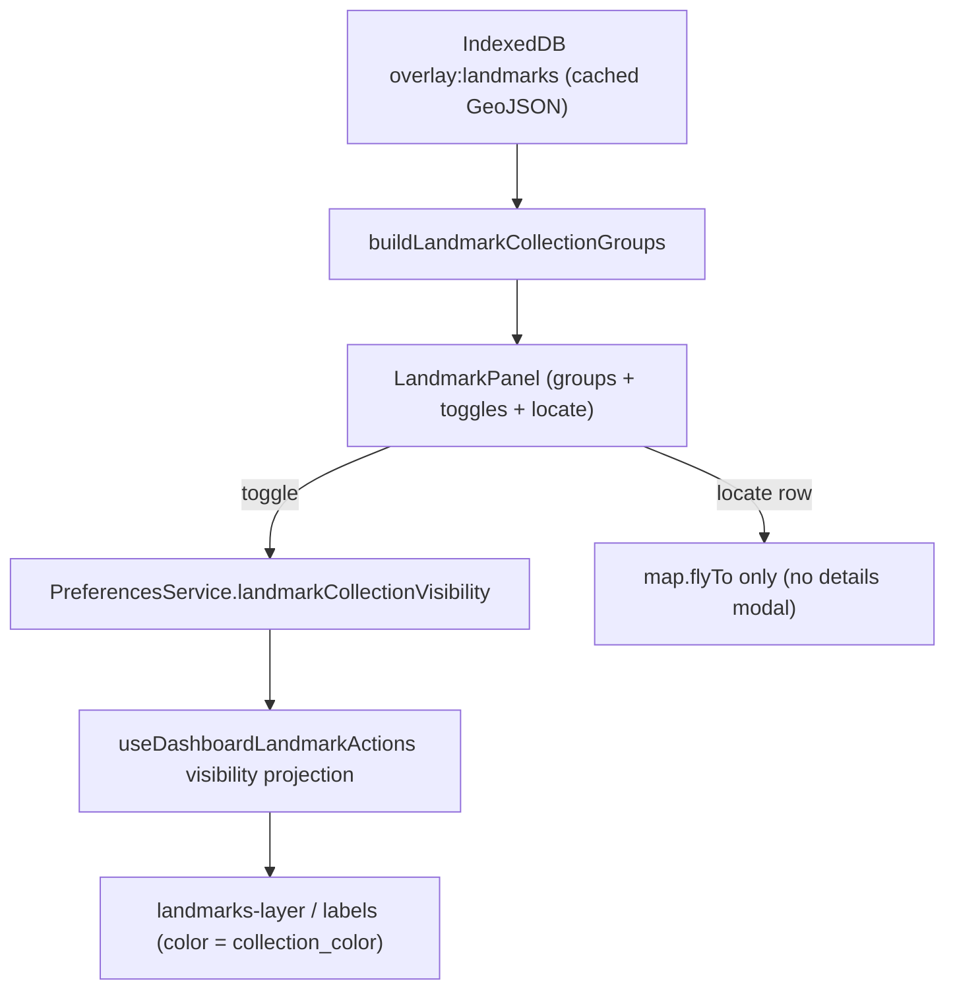

# Landmark Collections (Read-Only, Offline)

A read-only mirror of the SpeleoDB web map viewer's **Landmark Manager**,
adapted to the mobile app as a touch-friendly side panel reachable from a
dedicated **Landmarks** tab in the bottom tab bar.

## Feature intent

Browse landmarks grouped by their collection, control visibility per collection,
and locate any landmark on the map — all while fully offline.

This panel itself remains a read-only browse/locate surface. Landmark **create /
edit / delete** is a separate (online) surface reachable from the map
(long-press to create, tap a marker to edit/delete); see
`docs/landmark-crud.md`. Collection management (create/edit/delete collections,
bulk transfer) still exists only in the web viewer.

## Design space and decisions

- **Why derive collections from the cached GeoJSON instead of a new endpoint?**
  The backend `/api/v2/landmarks/geojson/` serializer
  (`LandmarkGeoJSONSerializer.to_representation`) already embeds the collection
  metadata on every feature:
  - `collection` (id), `collection_name`, `collection_type` (`SHARED` /
    `PERSONAL`), `collection_color`, `is_personal_collection`,
  - plus `can_write` / `can_delete` (unused here — read-only).

  Because all of that travels with the payload the app already caches for the
  map overlay, the entire panel (grouping, colors, private badges, counts) is
  built from cache with **zero** new endpoints, cache keys, or sync phases. This
  keeps the feature fully offline by construction and avoids a second source of
  truth.

- **Why a left slide-in panel + tab (not a modal)?** It mirrors the existing
  `ProjectPanel` visual language and the "tab opens a left panel" interaction,
  so the two panels feel like siblings. The Projects and Landmarks panels share
  the same left-edge slot and are mutually exclusive.

- **Two-level visibility.** A global master toggle (`showLandmarks`, in
  Settings) gates the whole overlay; per-collection toggles refine it. A
  landmark renders iff `showLandmarks` is on **and** its collection is not
  toggled off. Missing per-collection keys imply visible (same default-visible
  semantics as project visibility).

## Approach / data flow

1. `useDashboardMapData` loads the cached landmarks `FeatureCollection`
   (`controller.getOverlayGeoJSON('landmarks')`) like every other overlay.
2. `buildLandmarkCollectionGroups(featureCollection)`
   (`src/utils/landmarkCollections.ts`) groups features by `collection`,
   producing `LandmarkCollectionGroup[]` (personal-first, then alphabetical;
   landmarks alphabetical within a group; safe hex color fallback).
3. `LandmarkPanel` (`src/components/LandmarkPanel.tsx`) renders collapsible
   collection groups: color swatch, name, "Private" badge, count, and a
   per-collection visibility `IonToggle`. Each landmark row only flies the map
   to that landmark; the read-only details modal is reachable solely by tapping
   the marker on the map (see "Tap behavior" below).
4. `useDashboardLandmarkActions` filters drawn landmarks to visible collections,
   and `OverlayMapLayers` colors markers/labels by `collection_color`
   (`LANDMARK_COLLECTION_COLOR_EXPRESSION`).

## Key APIs / concepts

- **Grouping util:** `buildLandmarkCollectionGroups`, types
  `LandmarkCollectionGroup` and `LandmarkListItem`
  (`src/utils/landmarkCollections.ts`).
- **Panel:** `src/components/LandmarkPanel.tsx` (stateless; props in, callbacks
  out).
- **Tab:** `src/components/AppTabBar.tsx` — "Landmarks" tab placed between
  Projects and Map, using the `'landmarks'` member of `DashboardPanel`.
- **Panel state ownership / mutual exclusivity:**
  `src/AuthenticatedAppShell.tsx` owns one union value threaded through
  Dashboard, Settings, and Pending; see `docs/dashboard-panel-state.md`.
- **Persistence:** `UserPreferences.landmarkCollectionVisibility` and
  `landmarkCollectionCollapsed` (localStorage via `PreferencesService`), with
  `get/set` helpers mirroring project visibility. Missing key ⇒ visible /
  expanded.
- **Map color expressions:** `LANDMARK_COLLECTION_COLOR_EXPRESSION` and
  `LANDMARK_COLLECTION_HALO_EXPRESSION` in
  `src/pages/dashboard/OverlayMapLayers.tsx`.
- **Details enrichment:** `LandmarkDetails.collectionName` /
  `isPersonalCollection` (`src/utils/overlayMarkerDetails.ts`), rendered as a
  Collection field + Private badge in `OverlayMarkerDetailsModal.tsx`.

## Offline / lifecycle

- No network is required for any panel behavior; everything reads the same
  cached payload the map overlay uses. The controller's `hasNetworkAccess()`
  gate is untouched (no passive online/offline listeners added).
- Visibility/collapse preferences live alongside the other UI prefs and survive
  relaunches; they are cleared with the rest on logout.

### Satellite tile pre-caching for landmarks

So the map is usable offline around landmarks (not just projects),
`syncProjects()` schedules a single combined `landmarks` tile prefetch job
covering ALL landmarks, independent of the visibility toggles above. See
`docs/offline-mode.md` for the full pipeline. Key points:

- Tiles are collected as the deduped union of a padded box around each landmark
  point via `src/services/tilePrefetchPlanner.ts` (`extractPointCoordinates` +
  `buildTileUrlsForPoints`), avoiding a world-spanning bounding box.
- Zoom/pad policy is `TILE_PREFETCH.LANDMARK_REQUEST` in `src/constants.ts`
  (zoom 0-18, 50 m pad - parity with projects).
- The job is idempotent: its `commitId` is a stable signature of the landmark
  coordinates (`computeTilePrefetchSignature`), so unchanged landmarks are not
  re-downloaded.

#### Storage cap and user-approved overflow

Prefetched (project + landmark) tiles are pinned and cannot be evicted. They
share a single `MAP.TILE_CACHE_MAX_BYTES` (500 MB) cap. Because landmarks are
global, a large set can fill the cap; when a pinned write can no longer fit and
no unpinned tiles remain to evict, the tile cache raises
`TileCacheCapacityError`.

The app then surfaces a one-time consent prompt instead of silently failing:

- `OfflineMapSyncEngine` publishes `storage-blocked` and pauses the six-worker
  queue once (no hammering of doomed writes).
- The controller derives `isTileCacheOverLimit` / `needsAutoStoragePrompt` and
  shows a consent modal **once**. Both "Allow more storage" and "Not now"
  persist `tileCacheOverLimitPromptAcknowledged`, so the prompt never
  auto-reappears (this launch or future launches).
- "Allow more storage" persists `tileCacheOverLimitApproved`, lifts the cap in
  the tile-cache runtime (`setTileCacheOverLimitApprovedRuntime`), and resumes
  the stalled prefetch.
- Settings shows a tappable over-limit warning that manually re-opens the prompt
  (the only way to be re-prompted after the one-time auto popup), plus an "Extra
  storage allowed" status with a Revoke action when approved.
- Both flags are cleared on logout.
- The consent modal is mutually exclusive with the offline/companion-info
  modals. If one of those takes the slot while consent is open, the close is
  treated as gating (`storageConsentSuppressedByGate`) and does **not**
  acknowledge, so the user is never silently opted out; consent re-shows when
  the gate clears.
- Known caveat (by design): approved overflow is currently **unbounded** -- a
  large global landmark set at zoom 0-18 can grow the pinned cache to multiple
  GB. A bounded guardrail (landmark `maxZoom` and/or a max-tiles ceiling) is a
  tracked follow-up; today the landmark request keeps zoom/pad parity with
  projects (see `TILE_PREFETCH.LANDMARK_REQUEST`).

### Tap behavior

Tapping a landmark row in the panel only flies the map to that landmark (zoom).
The read-only details modal is reachable solely by physically tapping the marker
on the map (`handleLocateLandmark` in `src/pages/Dashboard.tsx` deliberately
does not open the modal).

## Read-only UX constraints (this panel)

- The Landmarks **panel** is strictly view + locate. Landmark create/edit/delete
  is handled on the map (see `docs/landmark-crud.md`), not from this panel.
- Collection create/edit/delete/move and bulk-transfer remain web-viewer only.

## Tests

- `src/utils/landmarkCollections.test.ts`
- `src/services/PreferencesService.test.ts`
- `src/utils/overlayMarkerDetails.test.ts`
- `src/components/OverlayMarkerDetailsModal.test.tsx`
- `src/components/LandmarkPanel.test.tsx`
- `src/components/AppTabBar.test.tsx`
- `src/pages/Dashboard.test.tsx`
