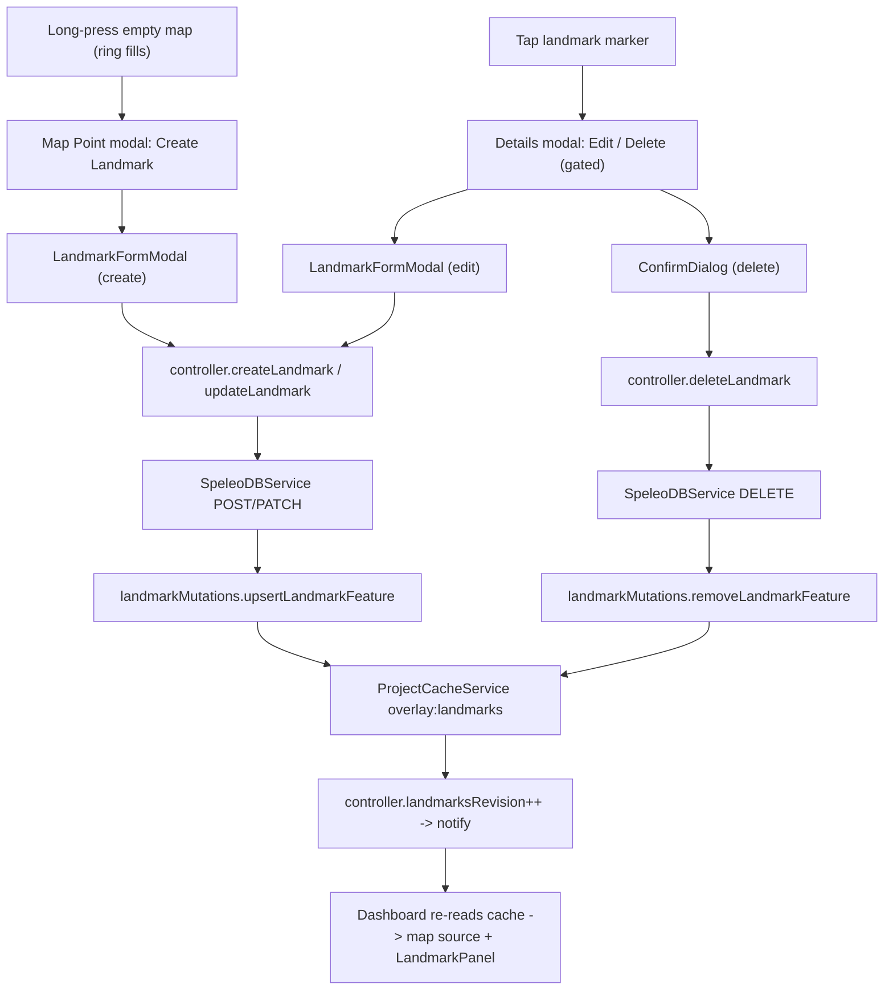

# Landmark CRUD (Online, Offline-Ready)

Create, edit, and delete landmarks from the mobile map viewer, mirroring the
SpeleoDB web map viewer's **Landmark Manager**. The online and offline paths
share one controller-owned mutation seam; the UI does not branch on transport
availability.

This complements `docs/landmark-collections.md`, which describes the read-only
browse/locate panel. That panel remains the browse surface; this document adds
the mutable surface (create/edit/delete) reachable from the map.

## Feature intent

- Long-press an empty spot on the map to drop a point. A circular loading ring
  fills during the press; on completion the **Map Point** modal opens with a
  **Create Landmark** action.
- Tap a landmark marker to open its details modal, which now offers **Edit
  Landmark** and **Delete Landmark** actions, each gated by the landmark's
  `can_write` / `can_delete` permission flags.
- Deletion always requires an explicit confirmation ("This action cannot be
  undone.").
- Create/Edit use a shared form with a collection picker (writable collections
  only, default "Personal Landmarks"), name, description, latitude, longitude.

## Design space and decisions

- **Why reuse the cached landmarks GeoJSON as the single source of truth?** The
  backend `/api/v2/landmarks/geojson/` payload already carries everything the
  map and the details modal need on every feature: `id`, `name`, `description`,
  `collection`, `collection_name`, `collection_color`, `is_personal_collection`,
  plus `can_write` / `can_delete`. `normalizeGeoJSON` does not strip properties,
  so after a successful mutation we can upsert/remove a single feature in the
  cached `FeatureCollection` and the map + panel update with zero refetch. This
  is also what makes the feature offline-ready: the same local apply works
  whether the write hit the network or a future offline queue.

- **Why a `landmarksRevision` counter instead of a reactive GeoJSON value?** The
  Dashboard already reads the cached overlay once on mount. Rather than thread a
  large `FeatureCollection` through the store on every change, the controller
  bumps a small monotonic `landmarksRevision`; the Dashboard re-reads the cache
  in an effect keyed on it. Cheap to diff, minimal blast radius. The same effect
  is also keyed on `lastSyncedAt`, so a landmark deleted/added on the web and
  pulled in by a later resync (not just the mount sync) also refreshes the map +
  panel.

- **Why a shared `LandmarkFormModal` for create and edit?** The two flows differ
  only in initial values and which API call fires on submit. One component keeps
  validation, the collection picker, and error handling in a single place.

- **Why full collection-picker parity?** The web viewer lets the user choose any
  collection they can write to and defaults to their personal collection. The
  app fetches the writable set from `/api/v2/landmark-collections/` and caches
  it so the picker is populated and the default is correct.

- **No drag-to-move (deferred).** The web viewer supports dragging a marker to
  move it; mobile uses editable latitude/longitude fields instead. Drag-to-move
  is a tracked follow-up.

## Backend API contract

All requests use `Authorization: Token <token>` (the same scheme the app uses
for every other authenticated GET). Base URL is the user's instance.

| Operation   | Method + URL                        | Body                                                       | Success                   |
| ----------- | ----------------------------------- | ---------------------------------------------------------- | ------------------------- |
| Create      | `POST /api/v2/landmarks/`           | `{ name, description?, latitude, longitude, collection? }` | `201 { landmark: {...} }` |
| Update      | `PATCH /api/v2/landmarks/<id>/`     | any subset of writable fields                              | `200 { landmark: {...} }` |
| Delete      | `DELETE /api/v2/landmarks/<id>/`    | none                                                       | `200 { message }`         |
| Collections | `GET /api/v2/landmark-collections/` | none                                                       | list of collections       |

Notes:

- `collection` is optional on create. Omitting it (or sending `null`) makes the
  backend assign the user's auto-created "Personal Landmarks" collection.
- Assigning a collection requires `READ_AND_WRITE` (level >= 2) on it.
- Editing/deleting a landmark requires `READ_AND_WRITE` on the landmark's
  collection. The UI gates the Edit/Delete actions on `can_write` /
  `can_delete`.

Landmark fields: `id` (uuid, read-only), `name` (required, <= 100 chars),
`description` (optional), `latitude` (-90..90), `longitude` (-180..180),
`collection` (uuid), plus read-only `collection_name`, `collection_color`,
`is_personal_collection`, `can_write`, `can_delete`, `created_by`,
`creation_date`, `modified_date`.

Errors:

- Duplicate `(collection, latitude, longitude)` ->
  `400 { error: "...already exists..." }`.
- Field validation -> `400 { errors: { <field>: [..] } }`.
- Insufficient permission -> `403`.

`PATCH` support required adding `'PATCH'` to `HttpClient`'s method union
(`src/services/HttpClient.ts`); both the native CapacitorHttp and web fetch
paths pass the verb through unchanged.

## Architecture / data flow

Single seam: `createLandmark` / `updateLandmark` / `deleteLandmark` in
`SpeleoDBController` are the only place that (1) call the service, (2) apply a
pure mutation to the cached `overlay:landmarks` `FeatureCollection`, (3) bump
`landmarksRevision`, and (4) `notify()`. The offline queue wraps step (1) with
an enqueue + later replay (see `docs/offline-op-queue.md`); steps (2)-(4) are
unchanged, and `getOverlayGeoJSON('landmarks')` folds pending ops over the
cached collection so the optimistic view needs no extra UI wiring.

## Key APIs / concepts

- **Constants:** `API.LANDMARKS_ENDPOINT`, `API.LANDMARK_COLLECTIONS_ENDPOINT`,
  `API.landmarkDetailEndpoint(id)`, and `MAP.LONG_PRESS_*` ring constants
  (`src/constants.ts`).
- **Types:** `LandmarkApiObject`, `LandmarkCollection`, `LandmarkCreateInput`,
  `LandmarkUpdateInput`, `LandmarkMutationError` (`src/types/landmark.ts`).
- **Service:** `createLandmark`, `updateLandmark`, `deleteLandmark`,
  `getLandmarkCollections` on top of a generalized private `authorizedRequest`
  (`src/services/SpeleoDBService.ts`).
- **Pure mutation util:** `validateLandmarkInput`,
  `buildLandmarkFeatureFromApi`, `upsertLandmarkFeature`,
  `removeLandmarkFeature`, `parseLandmarkMutationError`
  (`src/utils/landmarkMutations.ts`).
- **Controller:** `createLandmark`, `updateLandmark`, `deleteLandmark`,
  `getLandmarkCollections`, `landmarksRevision` (`SpeleoDBController.ts`).
- **Context:** `landmarksRevision` plus the CRUD methods are reached through the
  shared `controller` on `useSpeleoDB`.
- **Details parsing:** `LandmarkDetails` gains `canWrite`, `canDelete`,
  `collectionId`, `latitude`, `longitude` (`src/utils/overlayMarkerDetails.ts`).
- **UI:** `LandmarkFormModal`, `ConfirmDialog`, `LongPressRing`
  (`src/components/`), plus actions in `OverlayMarkerDetailsModal`.
- **Dashboard presentation:** `DashboardLandmarkDialogs` and
  `DashboardLandmarkFeedback` own detail/form/delete/toast/ring composition
  without owning mutation state.
- **Dashboard action owner:** `useDashboardLandmarkActions` owns collection
  preferences, form/delete/toast state, mounted completion guards, and the
  averaged-GPS-point handoff; `Dashboard` only wires its outputs to views.

## Long-press ring UX

While the user holds the map, a circular ring renders at the touch point after
`MAP.LONG_PRESS_RING_REVEAL_DELAY_MS` so normal quick taps do not flash an
animation. It then fills over the remaining hold time before
`MAP.LONG_PRESS_DURATION_MS`. Moving past the tap threshold cancels the press
(and the ring). On completion, a heavy haptic fires and the Map Point modal
opens. The ring is purely presentational and reuses the long-press timers in
`useDashboardMapInteractions`.

The ring only appears when a landmark could actually be created: the press is
armed only at/above `MAP.MARKER_INTERACTION_MIN_ZOOM` (`isMarkerInteractionZoom`
in `useDashboardMapInteractions`), so at low zoom ("high altitude") no ring
shows at all. The empty-spot requirement is enforced before the ring reveal and
again when the timer fires (`isEmptyMapSpotAtClientPoint`), so a long-press on
an existing landmark/overlay marker shows no ring and does not open Map Point.
Project survey lines/fills and the user's GPS location dot are intentionally
allowed so users can still create landmarks on mapped cave lines or at their
current position.

## Landmark feature id (important)

The backend GeoJSON puts the landmark id only at the **feature** level
(`feature.id = str(uuid)`) and does NOT include `id` in `properties`. MapLibre
does not reliably surface non-numeric feature ids through
`queryRenderedFeatures`, so a tapped landmark would otherwise resolve to an
unknown id and edit/delete would target the wrong record (the marker would not
disappear). `ensureLandmarkPropertyIds` (`src/utils/landmarkMutations.ts`)
copies `feature.id` into `properties.id` for the landmarks overlay before it
reaches the map; `properties` is always preserved by MapLibre, so taps resolve
the correct id. `buildLandmarkFeatureFromApi` already sets `properties.id` for
created/edited landmarks.

## Offline / lifecycle

- **Offline is now implemented.** While offline-locked (`hasNetworkAccess()` is
  false) -- or when an online request fails in a way that means "not reachable"
  (transport error / timeout / 5xx) -- the CRUD controller methods enqueue a
  persistent `OfflineOp` instead of rejecting, reflect it optimistically by
  folding it over the cached overlay, and replay it on the next sync. Definitive
  failures (4xx) still throw the typed `LandmarkMutationError`. The old "not
  available offline yet" rejection is gone. See `docs/offline-op-queue.md` for
  the queue, replay, and conflict design.
- The cached landmarks GeoJSON, the writable-collections list (now cached during
  sync so the offline create picker works), and the pending offline queue are
  all cleared with the rest of the caches on logout.
- **Cache-write concurrency.** `applyLandmarkUpsert` / `applyLandmarkRemoval`
  read-modify-write the cached `overlay:landmarks` collection. The UI serializes
  user mutations through per-flow `busy` flags (no two create/edit/delete run at
  once), so the only race window is a CRUD write overlapping a background
  project resync, whose `syncMapOverlaysPhase` full-overwrites the same cache
  from the server. That is last-writer-wins: a just-created landmark can be
  momentarily dropped from the cache if the server hasn't indexed it yet, and
  reappears on the next sync. This matches the web viewer's eventual-consistency
  model and is acceptable while online. Offline mutations are different: while
  queued ops exist or are actively replaying, project sync skips the landmarks
  overlay full-refresh so it cannot clobber the ground-truth layer underneath
  the optimistic fold. Other overlays still sync.

## Collection picker (async load)

The writable collection list is fetched (`controller.getLandmarkCollections`)
_after_ the form opens, so the form initially renders with an empty list and
only the synthetic "Personal Landmarks" fallback (value `''` ->
`collection: null`). When the real list arrives, `LandmarkFormModal` re-seeds
the picker's default to the personal collection **unless the user already
changed it**. This keeps the shown selection consistent with the value that is
submitted; without it the controlled `<select>` would hold a stale value that no
longer matches any rendered option, and the form could create the landmark in a
different collection than the one displayed.

## Tests

- `src/utils/landmarkMutations.test.ts`
- `src/services/SpeleoDBService.test.ts`
- `src/controllers/SpeleoDBController.test.ts`
- `src/components/LandmarkFormModal.test.tsx`
- `src/components/ConfirmDialog.test.tsx`
- `src/components/LongPressRing.test.tsx`
- `src/components/OverlayMarkerDetailsModal.test.tsx`
- `src/pages/dashboard/useDashboardLandmarkActions.test.ts`
- `src/pages/Dashboard.test.tsx`
