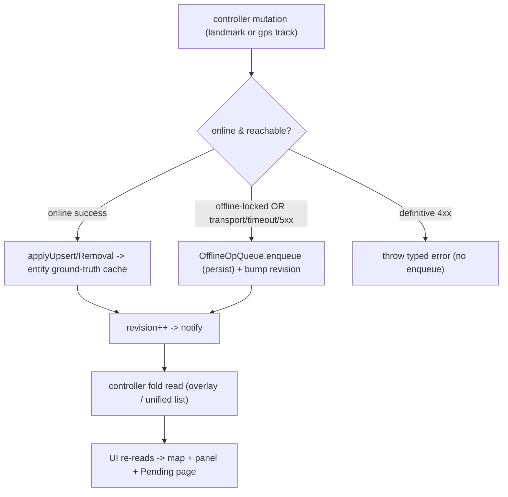

# Offline Op Queue (the canonical mutation pattern)

This is **THE** pattern for every offline-capable mutation in the app. Any
create / edit / delete that could be made while offline (or that fails in a way
that means "not reachable") is represented as an **`OfflineOp`** in **one**
shared queue, reflected optimistically in the UI, surfaced on the **Pending**
page, and replayed -- correctly, idempotently, and observably -- when
connectivity returns.

> Design rule: do **not** invent a second offline mechanism for a new entity.
> Add a new `OfflineEntityType`, subclass `OfflineOp`, extend the
> `OfflineReplayPort`, and route the controller mutation through
> `OfflineMutationCoordinator`. Everything (persistence, ordering, coalescing,
> conflict UI, the Pending page, the `pendingOpsCount` badge) is then inherited
> for free.

Entities today:

- **`landmark`** -- create / edit / delete (extends `docs/landmark-crud.md`).
- **`gpsTrack`** -- create (= upload the recorded GPX) / edit (name + color) /
  delete (see `docs/gps-tracks.md`).

## Feature intent

- A mutation must never be silently dropped because the device was offline or
  the network blipped. The user's intent is captured, shown, and survives app
  shutdown, crash, and phone restart.
- The UI updates immediately (optimistically) so offline work feels identical to
  online work.
- When connectivity returns, queued work replays against the authoritative
  server state. Where the server diverged, the user resolves the conflict with a
  clear, non-technical diff -- never an automatic "silently pick a winner".
- Replay is **user-initiated** from the Pending page (`Sync Now` / per-row
  `Sync`). Reconnect (`attemptReconnect` / successful startup validation) clears
  the offline lock and refreshes server data, but does **not** auto-drain the
  queue. This is uniform across **all** entities (GPS tracks included -- there
  is no separate auto-drain for uploads).

## The core decision: ground truth + fold

Two layers, per entity:

- **Ground truth**: a cached server snapshot, written **only** by a confirmed
  server response (a successful online mutation or a sync). Never mutated while
  offline.
  - landmarks: the `overlay:landmarks` `FeatureCollection` in
    `ProjectCacheService`.
  - gps tracks: the `gps-tracks` metadata list in `ProjectCacheService`
    (`RemoteGpsTrack[]`); local recordings live in the `gps_tracks` store.
- **Pending ops**: one ordered, persistent queue of `OfflineOp`s (`offline_ops`
  IndexedDB store), shared by all entities.

What the user sees is `fold(groundTruth, pendingOps)`, recomputed on demand:

- landmarks: `SpeleoDBController.getOverlayGeoJSON('landmarks')` ->
  `OfflineMutationCoordinator.foldLandmarks(fc)` -> queue fold (applies only
  landmark-entity ops).
- gps tracks: `SpeleoDBController.gpsTracks` (the unified list) merges local
  recordings with `OfflineMutationCoordinator.foldGpsTracks(remoteList)` and
  annotates each row with derived pending state from the same coordinator.

Why fold instead of mutating the cache and storing an "undo"? Discarding a
pending op (or reordering the queue) becomes a pure recompute -- no re-pull,
which matters because we may be offline. The ground truth is always a clean
server snapshot we can reconcile against.

Confirmed landmark and remote-GPS mutations update their collection through a
strict `CacheStore.update()` read-write transaction. The read, transformation,
and replacement therefore serialize at the IndexedDB store instead of using a
split `get`/`set` sequence that can lose concurrent results. Storage, schema,
and cancellation failures propagate to the mutation owner; no revision is
published and no durable offline operation is removed until the transaction
completes. This costs one transaction per confirmed mutation and adds no network
request.

## When does an op get enqueued?

The controller mutation classifies the outcome the same way for every entity:

- **offline-locked** (`hasNetworkAccess()` is false) -> enqueue immediately.
- **online, transport error / timeout / 5xx** (or `408`) -> "not reachable"; the
  controller calls `enterOfflineMode()` (flips the app offline, shows the
  offline modal, reveals Go Online) and enqueues. (`429` is rate limiting: kept
  pending without flipping offline.) Matches the request-driven offline model in
  `docs/networking.md`.
- **online, definitive 4xx** -> a definitive answer; a typed error is thrown and
  the UI shows it. Nothing is enqueued.
- **online success** -> the confirmed result is written into ground truth.

## The op model

`OfflineOp` (abstract, `src/offline/ops/OfflineOp.ts`) is entity-aware via
`entityType: 'landmark' | 'gpsTrack'`. It owns only pure capabilities:

- `applyTo(fc)` -- fold over a landmark `FeatureCollection` (landmark ops; no-op
  default for others).
- `applyToTrackList(tracks)` -- fold over the server GPS-track list (gps ops;
  no-op default for others).
- `describe()` -- a human summary for the pending list.
- `serialize()` -- the persistable shape (`SerializedOfflineOp`, discriminated
  by `entityType` + `kind`).
- `subjectId()` -- the entity id this op concerns.

Concrete subclasses:

- Landmarks: `CreateLandmarkOp`, `UpdateLandmarkOp`, `DeleteLandmarkOp`.
- GPS tracks: `CreateGpsTrackOp` (holds the recorded local track id; replay
  uploads its GPX), `UpdateGpsTrackOp` (`{name,color}`), `DeleteGpsTrackOp`.

Queue lifecycle and revision publication live in `OfflineMutationCoordinator`.
Network replay + conflict detection live in `OfflineOpQueue`, not on the ops, so
ops stay free of HTTP and are trivially unit-testable. The queue dispatches on
op type, and pulls the **right** server snapshot per entity lazily within a run
(a mixed landmark + gps run pulls both). `blockedSubjects` is namespaced by
`entityType:subjectId` so a landmark id can never block a track id.

### Conflict footprint ("last known state")

A **footprint** is the small set of server-owned, comparable fields:

- landmarks: `name`, `description`, `latitude`/`longitude` (rounded to 6 dp).
  `collection` is excluded. Full rationale in the landmark section below.
- gps tracks: `name`, `color` (`GpsTrackSnapshot`,
  `src/offline/gpsTrackSnapshot.ts`).

The **baseline** footprint is captured from ground truth at enqueue time (never
fabricated from the user's edit); `null` when no reliable upstream exists, which
disables conflict detection for that op (push without claiming a conflict). At
replay, a **fresh** footprint is built from the just-pulled server state and
compared: equal -> push; different (non-null baseline) -> conflict. For updates,
a first short-circuit treats "server already equals `next`" as already satisfied
(idempotent force-quit / two-device replay).

#### Landmark footprint specifics

Coordinates are rounded to **6 dp** because the create/edit API returns 7
decimals while `/landmarks/geojson/` serializes 6; comparing them raw flagged a
false conflict on every edit. `collection` is excluded because the personal
collection is represented irreconcilably across surfaces (UUID vs empty), with
no dependable client-side mapping -- a collection-only server move is treated as
last-writer-wins. Create-replay identity matching uses name + 6 dp coordinates.

## Persistence

Ops live in the `offline_ops` IndexedDB store (`OfflineOpStore`, one record per
op keyed by op id), so a force-quit mid-sync can only affect the single op being
mutated. Ground truth is written only after the server confirms, and an op is
removed only after ground truth is written, so any interruption replays cleanly.
Persistence failures fail closed: a mutation is not reported accepted unless its
op was durably written. Conflict/error statuses are persisted before a sync
summary returns, but transient statuses (`syncing`/`conflict`) are reset to
`pending` on load so conflicts are always re-derived live against the current
server. Cleared on logout via `ProjectCacheService.clearAll()`. Voluntary
Settings sign-out shows the exact pending count and requires explicit
acknowledgement that these operations will be permanently and irrecoverably
deleted. Forced credential-invalidating logout still purges without interaction.

All public enqueue/discard/replay/conflict commands share the queue's serialized
admission lane. Coalescing that changes operation type (update <-> delete)
commits the old-key removal and replacement record through
`OfflineOpStore.replace()` in one IndexedDB transaction. In-place replacements
also construct a new operation object; the in-memory queue, sequence counter,
conflict state, and UI revision change only after the durable transaction
completes. A failed or interrupted replacement therefore reopens with exactly
the previous intent. Serialization and one transaction add constant-time
bookkeeping and prevent duplicate records without extra database reads.

## Coalescing: one subject, one pending op

Enqueue coalesces so the queue never builds dependency chains and the pending
list stays readable. Landmarks:

- Edit a not-yet-synced create -> mutate the create in place.
- Delete a not-yet-synced create -> drop the create entirely.
- A second edit -> replaces the earlier edit's `next` (keeps the original
  baseline). A delete supersedes a pending edit (inherits its baseline). An edit
  supersedes a pending delete.

GPS tracks follow the same shape for server-track update/delete (a second edit
replaces, a delete supersedes an edit and inherits its baseline, an edit
supersedes a delete). A `CreateGpsTrackOp` is keyed by the **local** recording
id; re-queuing the same recording replaces it in place, and deleting a local
recording with a pending upload discards that create op
(`discardGpsTrackOpsForSubject`).

## Replay + conflict semantics

`syncAll()` / `syncOne(id)` run in chronological order; the relevant server
snapshot(s) are pulled once per run. A run pulls only the snapshots its targeted
ops need (landmarks and/or GPS tracks); a **mixed** landmark + GPS run pulls
both. If _either_ required pull fails, the whole run aborts as `pull_failed` and
nothing replays -- so a transient GPS-track-list fetch failure also defers any
landmark ops queued in the same run (and vice versa). This is intentional: a
failed ground-truth pull means the server is unreachable, so no op is safe to
replay; the user simply syncs again from the Pending page. Per op type:

Replay and conflict-resolution commands enter one queue-owned serialized lane.
Overlapping `syncAll()` callers are compatible and share the active result;
single-op sync and conflict choices wait and re-read the current durable queue
when admitted. Consequently, rapid taps or two callers in the same render frame
cannot pull and mutate the same operation concurrently. The lane is promise
based (no polling, timers, or extra persistence) and remains usable after a
command rejects.

- **landmark create** -> first identity-match the freshly pulled snapshot and
  adopt an existing result (covers a prior server success followed by local
  transaction failure); otherwise POST. A 2xx captures id + upserts; a
  `400 duplicate` triggers one fresh pull, then identity-match + adopt; other
  4xx -> `error`; 5xx/transport -> abort rest.
- **landmark update/delete** -> idempotent short-circuit, then baseline compare,
  then PATCH/DELETE (404 on delete = success).
- **gps create** -> `uploadGpsTrack(localId)` builds the GPX and PUTs it to
  `/api/v2/import/gpx/`. The server dedupes by file sha256, so a re-upload is
  **idempotent** (returns zero counts) -- still success. On success the local
  recording is deleted and the track list re-syncs (`onGpsTrackCreated`). No
  conflict path. A local build error (empty/invalid GPX) is a definitive 4xx.
- **gps update** -> idempotent short-circuit, baseline compare, then
  `PATCH /api/v2/gps_tracks/<id>/ {name,color}`; upsert preserves the cached
  `fileUrl`/`sha256`.
- **gps delete** -> baseline compare, then `DELETE /api/v2/gps_tracks/<id>/`
  (404 = success); also clears the cached per-track GeoJSON.

A conflict (or error) for a subject blocks later ops for the **same** subject in
that run but does not stop the rest of the queue (partial failure is fine).

### Conflict resolution

`resolveOfflineOpConflict(id, 'local' | 'server')`:

- **local** ("Keep my change") -> force the request regardless of server drift,
  then write ground truth and drop the op. A definitive 4xx leaves the op
  `error`.
- **server** ("Use server version") -> discard the op and adopt the current
  server state into ground truth.

`OfflineOpConflictModal` is entity-agnostic: it renders `entityLabel`
("landmark" / "GPS track"), the op `title`, the `kind`, the `server === null`
("removed") case, and the field `rows` diff. No ids, no jargon.

## UX

- A **Pending** tab appears in the bottom tab bar (between Map and Settings)
  only when there are queued ops, with a count badge (`pendingOpsCount`). Route
  `/pending`.
- The **Pending Changes** page (`src/pages/PendingOps.tsx`) lists ops
  newest-first with a kind badge, title, summary, and timestamp; **Sync Now**
  drains the queue; each row has **Sync** / **Resolve** / **Delete**. It renders
  landmark and GPS-track ops identically.

## Key APIs / source map

- Types: `src/types/offlineOp.ts` (`OfflineEntityType`, `SerializedOfflineOp`,
  `OfflineOpView`, `OfflineOpConflict`).
- Snapshot/diff helpers: `src/offline/landmarkSnapshot.ts`,
  `src/offline/gpsTrackSnapshot.ts`.
- Ops:
  `src/offline/ops/{OfflineOp,CreateLandmarkOp,UpdateLandmarkOp, DeleteLandmarkOp,CreateGpsTrackOp,UpdateGpsTrackOp,DeleteGpsTrackOp, deserialize}.ts`.
- Persistence: `src/offline/OfflineOpStore.ts` (+ `offline_ops` in
  `src/services/CacheStore.ts`).
- Orchestration: `src/offline/OfflineOpQueue.ts` (`OfflineReplayPort`,
  `foldOver`, `foldGpsTracks`, `gpsPendingBySubject`, `enqueue*`, replay,
  conflict).
- Controller seam: `SpeleoDBController` -- landmark CRUD, GPS
  `uploadGpsTrack`/`editGpsTrack`/`removeGpsTrack`/`syncGpsTracks`,
  `getOverlayGeoJSON`, `gpsTracks`, `getPendingOps`, `syncOfflineOps`,
  `syncOfflineOp`, `discardOfflineOp`, `resolveOfflineOpConflict`,
  `pendingOpsCount`, `pendingOpsRevision`.
- UI: `src/pages/PendingOps.tsx`, `src/components/OfflineOpConflictModal.tsx`,
  `src/components/AppTabBar.tsx`.

## Reuse: averaged GPS points

The GPS menu's "collect an averaged point and save it as a landmark" flow reuses
this queue verbatim via the shared `LandmarkFormModal` +
`controller.createLandmark`, so saving offline enqueues a `CreateLandmarkOp`.
See `docs/gps-tracks.md`.

## Tests

- Pure units: `src/offline/landmarkSnapshot.test.ts`,
  `src/offline/gpsTrackSnapshot.test.ts`, op classes, and
  `src/offline/OfflineOpQueue.test.ts` (fold, coalescing, replay, conflict,
  resolve, id remap, **GPS create/update/delete**, mixed-entity runs).
- Persistence + migration: `src/offline/OfflineOpStore.test.ts`.
- Controller: `src/controllers/SpeleoDBController.test.ts` (landmark + GPS
  offline enqueue, online network-failure enqueue, online 4xx no-enqueue, folded
  reads, upload create op delete+resync, Pending-page drain).
- Components: `src/pages/PendingOps.test.tsx`,
  `src/components/OfflineOpConflictModal.test.tsx`,
  `src/components/AppTabBar.test.tsx`.
